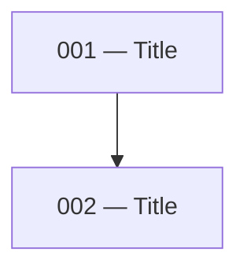

# Plan or Spec to Issues

## Input

You will be given one of:

- A **local plan or spec file** — a markdown file on disk, typically produced by the `/create-technical-spec` skill
- A **GitHub issue** — referenced by URL or issue number on the current repo, typically produced by the `/create-technical-spec` skill in issue mode

Read the source document thoroughly before doing anything else (fetch via `gh issue view <num> --json title,body -q .body` if it's an issue). If a local spec carries a `<!-- github-issue: #N ... -->` promote stamp, the issue is the source of truth — read its body, not the (possibly stale) local file.

## Output Modes

The skill has two modes:

- **Local mode** (default for local file inputs) — generates dependency-ordered markdown files under `docs/issues/<feature-slug>/`. Best for specs that live locally and aren't tracked on GitHub.
- **Online mode** (default for GitHub issue inputs) — creates a parent issue-set hub issue (linking the technical spec and recording the workflow) plus GitHub sub-issues attached to that hub, with native blocking dependencies. No local files are written. Best when the spec is already an issue so cloud sessions and collaborators can work from it.

### Mode detection

- Input is a **GitHub issue URL or number** → online mode
- Input is a **local file path** → local mode — *unless* it carries a `<!-- github-issue: #N ... -->` promote stamp → **online mode** (the spec is already an issue)
- **Explicit override tokens**: `--online` / `--sub-issues` force online mode; `--local` forces local mode. For online mode on a local file, the file must contain a `<!-- github-issue: #N ... -->` stamp identifying the source spec issue, or the user must supply the spec issue reference.
- **Phrases** also work: "as sub-issues", "create GitHub sub-issues", "keep local", etc.

---

## Proposal & Approval (required before any writes)

After decomposing the spec (Step 2 in either mode) and **before writing any files or creating any GitHub issues**, present the proposed decomposition to the user and wait for explicit approval.

The proposal must include, for each planned issue:
- Its number (or dependency position) and title
- A one-sentence summary
- Its blockers (by number/title)
- The key files or components it will touch

Also surface:
- The dependency order across the set (a short list or mini graph is fine)
- Any scope items from the source spec you are deliberately excluding, and why
- The mode that will be used (Local or Online) and, for Online, the source spec issue and the title of the issue-set hub that will be created
- The **feature branch** all issue worktrees will branch off (propose `feat/<feature-slug>` derived from the spec slug; the user can override). This branch is the merge target for every issue PR — it is never merged into the default branch until QA has been done and the user explicitly triggers it.

Wait for the user to say "approved", "go ahead", "looks good", "proceed", or to send revisions. If they request changes, update the decomposition and re-propose. Do not skip this step even if the decomposition seems obvious — creating issues or files prematurely is costly to undo (especially on GitHub).

---

## Local Mode

### Step 1 — Identify the output directory

Check whether an issues directory already exists for this feature:

- Look for `docs/issues/<feature-slug>/` relative to the project root
- If it exists, read the existing files to understand numbering already in use
- If it does not exist, you will create it

Ask the user for the feature slug if it is not obvious from the plan or spec.

### Step 2 — Decompose into issues

Break the plan or spec into discrete, independently implementable units of work. Each issue should:

- Represent a single coherent piece of the system (a service, a schema group, a controller, a handler, etc.)
- Be small enough to implement in one focused session
- Have clearly definable inputs (blockers) and outputs (what it unblocks)

Identify the dependency order across all issues before writing any files. Schema and data layer issues come before service issues; service issues come before controller and handler issues.

### Step 3 — Write the issue files

> **Gate:** Only proceed once the user has approved the proposal (see [Proposal & Approval](#proposal--approval-required-before-any-writes)).

**The implementer will read the spec.** Issue files exist to carve out a clear boundary — not to rewrite the source document. Keep every section as short as possible. If something is already explained in the spec, point to it; do not repeat it.

**Set the spec link from the source document's real path, and verify it resolves.** The `Plan reference` link must be the actual relative path from `docs/issues/<feature-slug>/` to wherever the source document lives at the time of writing (`specs/`, `docs/technical-specs/`, or elsewhere). After writing the files, confirm each link resolves to an existing file. Note these links can still go stale later if the spec is *moved* — that is a maintenance hazard outside this skill's control, so keep `Plan reference` a single, easy-to-update line rather than scattering the path through the issue body.

For each issue, create a file at:

```
docs/issues/<feature-slug>/NNN-<slug>.md
```

Where `NNN` is a zero-padded three-digit number starting from `001`, ordered by dependency (earliest dependencies first).

Each file must follow this structure exactly:

````markdown
# NNN — <Title>

> **Before you start:** Read the [Issue set README](README.md) in full first.

## Plan reference

[<Plan or Spec title>](<relative path to source document>) — <relevant sections>

[Issue set README](README.md) — dependency map and parallel levels

## Summary

<One sentence naming what this issue builds.>

## Blockers

- **Issue NNN** — <specific methods, schemas, or exports that must exist before this issue can start>

_(omit this section if there are no blockers)_

## Scope

<Concise breakdown of what to implement. Use short bullet points per file or component — name the method, field, or route and state what it does in one line. Do not reproduce content already in the spec; point to the relevant section instead. The implementer will read the spec. This section exists to draw a clear boundary around the issue, not rewrite the source document.>

## Files to create/modify

**New:**
- `<path>`

**Modified:**
- `<path>` — <what changes>

_(omit a category if empty)_

## Unblocks

- Issue NNN (<Title>) — <what this issue provides that unblocks it>

_(omit this section if this issue unblocks nothing)_
````

### Step 4 — Verify the set

Before finishing, check across all issues:

- Every blocker reference points to a real issue in the set
- Every unblocks reference points to a real issue in the set
- No issue is both a blocker and unblocked by the same issue (circular dependency)
- The numbering order matches the dependency order — if issue 003 blocks issue 001, renumber
- No scope items are duplicated across issues

### Step 5 — Generate the README

Create `docs/issues/<feature-slug>/README.md` with the following sections in order.

#### Feature branch

The first line of the README (after the title) must be a `## Feature branch` section recording the branch agreed on during the proposal:

```markdown
## Feature branch

`feat/<feature-slug>`

All issue worktrees branch off this. Every issue PR targets this branch — not the default branch. The feature branch is only merged into the default branch once all issues are merged and QA has passed.
```

#### Summary table

| File | Title | Level |
|------|-------|-------|
| `NNN-<slug>.md` | Title | 1 |

Level is the dependency depth: issues with no blockers are level 1, issues that only depend on level-1 issues are level 2, and so on.

#### Mermaid dependency map

Build a directed graph from the blocker/unblocks relationships across all issues:

````markdown

````

Each node is `NNN["NNN — Title"]`. Each edge goes from blocker to dependent (`blocker --> dependent`). Issues with no edges still appear as isolated nodes.

#### Parallel levels table

Group issues by their level. For each level, write a natural-language note describing when to start and whether issues in that level can be worked in parallel:

| Level | Issues | Notes |
|-------|--------|-------|
| 1 | 001, 002 | No dependencies. Both can be opened in separate worktrees and worked simultaneously. |
| 2 | 003 | Start after 001 and 002 are merged. |
| 3 | 004, 005 | Both unblocked by 003. Can be picked up in parallel worktrees once 003 is merged. |

#### Picking up an issue

```markdown
## Picking up an issue

1. Verify all blockers for the issue are merged — do not start against unmerged dependency branches
2. Invoke the `/implement-spec` skill — this guides you through creating a worktree entry, implementing the feature or task, and raising a PR.

## QA

Do not run QA on individual issues. QA should only happen once all issues in this set are merged and the feature is fully assembled. Do not initiate any QA pass unless the user explicitly asks for it.
```

### Step 6 — Report

List all issues created with their titles and a one-line description. Flag any scope items from the source plan that were deliberately excluded and why.

---

## Online Mode

No local files are written. The skill creates a **parent issue-set hub** issue — the online equivalent of the local README — that links the technical spec and records the workflow rules (feature branch, pick-up steps, QA rule). All sub-issues attach to this hub, **not** to the spec issue, and GitHub's native sub-issue and issue-dependency relationships render the hierarchy and blockers on the hub page directly.

The **technical spec stays a technical spec** — its own issue (or local file). The hub is a separate, lightweight coordination issue that points at it, exactly as the local README sits beside the spec rather than replacing it.

### Step 1 — Resolve the source spec

- If the input is an issue URL or number, that's the source spec issue.
- If the input is a local file with a `<!-- github-issue: #N https://github.com/<owner>/<repo>/issues/N -->` stamp, that stamp identifies the source spec issue.
- Fetch the spec body: `gh issue view <spec> --json body -q .body` (or read from the local file).

### Step 2 — Decompose into issues

Same analysis as local mode Step 2. Identify discrete units of work and their dependency order before creating anything on GitHub. Do this work in memory — do not write scratch files.

### Step 3 — Create the issue-set hub

> **Gate:** Only proceed once the user has approved the proposal (see [Proposal & Approval](#proposal--approval-required-before-any-writes)). This is especially important in online mode — created GitHub issues can't be cleanly undone, only closed.

Create the hub first; every sub-issue attaches to it. The hub is the README-equivalent: the single place that links the spec and records the workflow.

1.  Render the hub body to `/tmp/issue-set-<feature-slug>-<timestamp>.md` using this structure:

    ```markdown
    ## Technical spec

    #<spec-number>

    ## Feature branch

    `feat/<feature-slug>`

    All sub-issue worktrees branch off this. Every sub-issue PR targets this branch — **never the default branch**. The feature branch is only merged into the default branch once all sub-issues are merged and QA has passed.

    ## Picking up a sub-issue

    1. Verify all blockers (shown in this issue's dependency graph) are merged — do not start against unmerged dependency branches.
    2. Invoke the `/implement-spec` skill — it creates a worktree, implements the work, and raises a PR against the feature branch above.

    ## QA

    Do not run QA on individual sub-issues. QA happens only once every sub-issue is merged and the feature is fully assembled, and only when the user explicitly asks for it.
    ```

2.  Create it and capture its number + node ID:

    ```bash
    gh issue create --title "<Feature> — Implementation Issue Set" --body-file /tmp/issue-set-<feature-slug>-<timestamp>.md
    gh api "/repos/<owner>/<repo>/issues/<hub-number>" --jq .id
    ```

### Step 4 — Sub-issue body structure

Keep sub-issue bodies minimal — GitHub renders the parent (hub) link and blocking relationships natively, so duplicating them in the body is noise.

Each sub-issue body must follow this structure:

```markdown
> **Before you start:** Read the parent issue set (#<hub-number>) in full first.

## Spec reference

#<spec-number> — <relevant sections>

## Summary

<One sentence naming what this issue builds.>

## Scope

<Concise bullet points per file or component — name the method, field, or route and state what it does in one line. Point to the relevant section of the spec rather than repeating it.>

## Files to create/modify

**New:**
- `<path>`

**Modified:**
- `<path>` — <what changes>

_(omit a category if empty)_
```

Do not include a "Blockers" or "Unblocks" section — GitHub's dependency graph on the hub and on each sub-issue shows this.

### Step 5 — Create sub-issues in dependency order

For each decomposed issue, in dependency order (earliest dependencies first):

1.  Render the body using the structure from Step 4 and write it to `/tmp/subissue-<slug>-<timestamp>.md`. `/tmp` is self-cleaning on reboot.
2.  Create the issue:
    ```bash
    gh issue create --title "<Title>" --body-file /tmp/subissue-<slug>-<timestamp>.md
    ```
    Capture the new issue's number and node ID. Get the ID via:
    ```bash
    gh api "/repos/<owner>/<repo>/issues/<number>" --jq .id
    ```
3.  Attach as a sub-issue of the **hub** using the GitHub Sub-Issues API:
    ```bash
    gh api -X POST "/repos/<owner>/<repo>/issues/<hub-number>/sub_issues" -F sub_issue_id=<child_id>
    ```
4.  For each blocker (a previously created sub-issue this one depends on), add a blocking relationship using the GitHub Issue Dependencies API. Use `gh api` with the current dependencies endpoint (the agent should verify exact syntax against GitHub's docs at the time of execution; the relationship is "this issue is blocked by <blocker>"). If the API call fails, fall back to adding a `Blocked by #N` line in the issue body so the relationship is at least human-readable.

### Step 6 — Verify

After all sub-issues are created:

- Each sub-issue appears under the hub's "Sub-issues" list (check via `gh api "/repos/<owner>/<repo>/issues/<hub-number>/sub_issues"`).
- Each blocking relationship renders on the dependent issue's page.
- The hub body links the technical spec and records the feature branch.
- No circular dependencies (if the dependencies API accepted a cycle, revisit the decomposition).

### Step 7 — Report

Report back with:
- The issue-set hub URL (and the technical spec issue URL)
- A bullet list of created sub-issues (number, title, URL, blockers)
- Any scope items from the source spec that were deliberately excluded and why

Do not instruct the user to look at local files — there are none.
