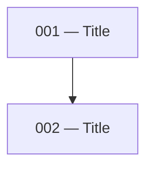

# Local Mode

Generates dependency-ordered markdown files under `docs/issues/<feature-slug>/`. No GitHub issues are created.

> The decomposition and the [Proposal & Approval](../SKILL.md#proposal--approval-required-before-any-writes) gate happen in the main skill before this guide's write steps run.

## Step 1 — Identify the output directory

Check whether an issues directory already exists for this feature:

- Look for `docs/issues/<feature-slug>/` relative to the project root
- If it exists, read the existing files to understand numbering already in use
- If it does not exist, you will create it

Ask the user for the feature slug if it is not obvious from the plan or spec.

## Step 2 — Write the issue files

> **Gate:** Only proceed once the user has approved the proposal.

**The implementer will read the spec.** Issue files exist to carve out a clear boundary — not to rewrite the source document. Keep every section as short as possible. If something is already explained in the spec, point to it; do not repeat it.

**Set the spec link from the source document's real path, and verify it resolves.** The `Plan reference` link must be the actual relative path from `docs/issues/<feature-slug>/` to wherever the source document lives at the time of writing (`specs/`, `docs/technical-specs/`, or elsewhere). After writing the files, confirm each link resolves to an existing file. Note these links can still go stale later if the spec is *moved* — that is a maintenance hazard outside this skill's control, so keep `Plan reference` a single, easy-to-update line rather than scattering the path through the issue body.

For each issue, create a file at:

```
docs/issues/<feature-slug>/NNN-<slug>.md
```

Where `NNN` is a zero-padded three-digit number starting from `001`, ordered by dependency (earliest dependencies first).

Each file must follow this structure exactly:

````markdown
# NNN — <Title>

> **Before you start:** Read the [Issue set README](README.md) in full first.

## Plan reference

[<Plan or Spec title>](<relative path to source document>) — <relevant sections>

[Issue set README](README.md) — dependency map and parallel levels

## Summary

<One sentence naming what this issue builds.>

## Blockers

- **Issue NNN** — <specific methods, schemas, or exports that must exist before this issue can start>

_(omit this section if there are no blockers)_

## Scope

<Concise breakdown of what to implement. Use short bullet points per file or component — name the method, field, or route and state what it does in one line. Do not reproduce content already in the spec; point to the relevant section instead. The implementer will read the spec. This section exists to draw a clear boundary around the issue, not rewrite the source document.>

## Files to create/modify

**New:**
- `<path>`

**Modified:**
- `<path>` — <what changes>

_(omit a category if empty)_

## Unblocks

- Issue NNN (<Title>) — <what this issue provides that unblocks it>

_(omit this section if this issue unblocks nothing)_
````

## Step 3 — Verify the set

Before finishing, check across all issues:

- Every blocker reference points to a real issue in the set
- Every unblocks reference points to a real issue in the set
- No issue is both a blocker and unblocked by the same issue (circular dependency)
- The numbering order matches the dependency order — if issue 003 blocks issue 001, renumber
- No scope items are duplicated across issues

## Step 4 — Generate the README

Create `docs/issues/<feature-slug>/README.md` with the following sections in order.

### Feature branch

The first line of the README (after the title) must be a `## Feature branch` section recording the branch agreed on during the proposal:

```markdown
## Feature branch

`feat/<feature-slug>`

All issue worktrees branch off this. Every issue PR targets this branch — not the default branch. The feature branch is only merged into the default branch once all issues are merged and QA has passed.
```

### Summary table

| File | Title | Level |
|------|-------|-------|
| `NNN-<slug>.md` | Title | 1 |

Level is the dependency depth: issues with no blockers are level 1, issues that only depend on level-1 issues are level 2, and so on.

### Mermaid dependency map

Build a directed graph from the blocker/unblocks relationships across all issues:

````markdown

````

Each node is `NNN["NNN — Title"]`. Each edge goes from blocker to dependent (`blocker --> dependent`). Issues with no edges still appear as isolated nodes.

### Parallel levels table

Group issues by their level. For each level, write a natural-language note describing when to start and whether issues in that level can be worked in parallel:

| Level | Issues | Notes |
|-------|--------|-------|
| 1 | 001, 002 | No dependencies. Both can be opened in separate worktrees and worked simultaneously. |
| 2 | 003 | Start after 001 and 002 are merged. |
| 3 | 004, 005 | Both unblocked by 003. Can be picked up in parallel worktrees once 003 is merged. |

### Picking up an issue

```markdown
## Picking up an issue

1. Verify all blockers for the issue are merged — do not start against unmerged dependency branches
2. Invoke `/implement-spec` and follow it — it carries the work from intent to PR. This is required, not optional.

## QA

Do not run QA on individual issues. QA should only happen once all issues in this set are merged and the feature is fully assembled. Do not initiate any QA pass unless the user explicitly asks for it.
```

## Step 5 — Report

List all issues created with their titles and a one-line description. Flag any scope items from the source plan that were deliberately excluded and why.
